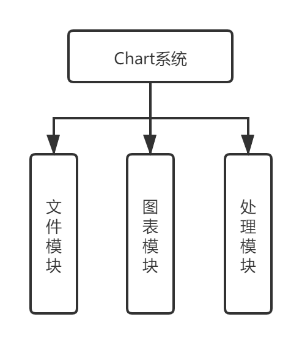

# Chart系统概要设计
## 1. 项目概述
本项目使用Java语言作为开发语言，运用JDK8自带的JavaFX框架进行图形用户界面开发，实现一款基础的图表显示系统。  
该系统应该支持从任意二进制文件当中读取数据，并将该数据映射显示到图标当中。同时，为了便于查看数据，该系统应该支持图表的缩放和拖动显示，从而显示文件当中的部分数据，防止由于文件过大导致数据点过于密集，无法看清。为了适应用户对于数据进行处理的需求，本系统还应该支持对读取的原始数据进行微分、积分等简单的处理。
## 2. 系统设计
### 2.1 系统结构设计
 
如上图所示，Chart系统主要分为文件读取模块、图表显示模块、数据处理模块这三个模块。其中： 
+ **文件读取模块**负责读取任意二进制文件，将文件的二进制字节流中每16位读作一个16位整数，并由此获取数据。
+ **图表显示模块**则负责将文件处理模块所读取到的数据或是数据处理模块进行处理后的数据可视化地显示到图表当中。这一模块负责实现图表显示、图表缩放、拖动显示图表等功能。
+ **数据处理模块**则负责对从文件读入的原始数据进行一些简单的数据处理，如微分、积分等，并由此输出新的数据，这部分数据也应该可以被显示在图表当中。
### 2.2 模块关联
 
如上图所示，本系统的三个模块之间存在着响应的关联以及调用关系。文件读取模块负责从二进制文件当中读取数据，而后将数据传输到数据处理模块进行处理，或是直接传输到图表显示模块向用户显示。  
数据处理模块对数据进行处理后，也需要将数据传递给图表显示模块，并由图表显示模块将结果可视化地显示给用户。
### 2.3 系统部署
本系统对于所部署的计算机硬件配置没有强制要求，为了保证运行流程，应尽可能选择内存大于4G的计算机。在操作系统方面，支持部署在Windows, Linux等主流操作系统上。
## 3. 接口设计
### 3.1 数据文件
Chart系统应该可以打开计算机中存储的任意文件，包括各种文件格式。并且将这些文件的数据以二进制形式读取，将每16位读作一个整数，以作为Chart系统的数据源。
### 3.2 用户界面设计

如上图所示，用户界面主要分为三个部分。上方菜单栏主要负责进行文件操作，后续可能会进一步添加其他功能，如设置、帮助等。左侧操作栏主要负责对文件输入的原始数据进行处理，如图中所示的微分、积分等处理。右侧图表栏则负责显示图表界面。