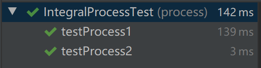
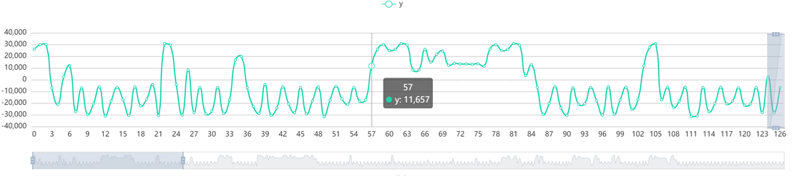
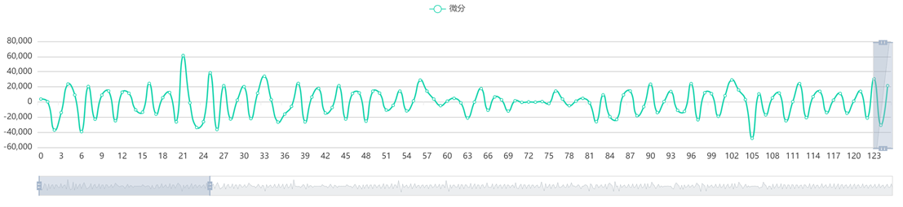

# Chart系统测试报告
## 1. 测试概述
对于Chart系统，我对其进行了单元测试和集成测试。其中，单元测试主要对各主要功能模块进行了测试，确保了功能模块的正确运行。在进行单元测试之后，将相应的模块进行组装，并进行集成测试。
## 2. 单元测试
### 2.1	文件读取模块
#### 2.1.1	模块概述
文件读取模块主要实现的功能即为将二进制文件当中的数每16位读取到一个short型整数当中，以用于后续的图表生成。
#### 2.1.2测试用例
主要测试为输入字节码后，测试输出的16位整数是否符合预期。 
**用例一：** 
+ 输入： 0x00, 0x01,0x00, 0x1e, 0x02, 0x3a, 0x09, 0x1d, 0x3f, 0x7a,-0x3f, 0x12
+ 预期结果：1, 30, 570, 2333, 16250, -16110

**用例二：**
+ 输入：0x00, 0x01,0x00, 0x1e, 0x02, 0x3a, 0x09, 0x1d
+ 预期结果：256, 7680, 14850, 7433

#### 2.1.3 测试结果
单元测试用例通过2/2。

### 2.2	数据处理模块
#### 2.2.1 模块概述
数据处理模块主要负责将文件读取模块读取得到的数据进行一些简单的处理，以生成新的数据，并可用于生成另外一张图表。本项目中简单实现了微分和积分处理，由于生成的图表本身为折线图，这里我们的微分和积分计算是通过差分和求和来简化完成的。也就是说，DifferentialProcess类生成的是将数据源列表中的后一项减去前一项所得到的差分结果，而IntegralProcess类生成的则是将数据源列表中的点与其前99项求和所得到的结果。
#### 2.2.2 测试用例
##### 2.2.2.1	DifferentialProcess类

**process()方法**: 
**用例一：**
+ 输入：[0, 1, 2, 3, 4]
+ 期望输出：[1, 1, 1, 1]
+ 实际输出：[1, 1, 1, 1]
##### 2.2.2.2 IntegralProcess类
**process()方法**: 
**用例一：**
+ 输入：[1, 1, 1, 1, 1, 1, 1, 1, 1, 1]
+ 期望输出：[1, 2, 3, 4, 5, 6, 7, 8, 9, 10]
+ 实际输出：[1, 2, 3, 4, 5, 6, 7, 8, 9, 10]
**用例二：**
+ 输入：[1, 1, 1, …, 1]（共200个1）
+ 期望输出：[1, 2, 3, …, 100, 100, …, 100] （后续共101个100）
+ 实际输出：[1, 2, 3, …, 100, 100, …, 100]
#### 2.2.3 测试结果
单元用例测试通过：3/3

 

## 3.	集成测试
### 3.1	测试环境
#### 3.1.1	硬件环境
对该系统进行测试的硬件设备信息如下：
+ 品名：Microsoft Surface
+ CPU: Intel(R) Core(TM) i5-7300U CPU @ 2.60GHz 2.71 GHz
+ RAM: 8GB
#### 3.1.2	软件环境
该测试基于以下软件环境进行：
+ Microsoft Windows 10 2004
+ JDK 8
### 3.2	测试过程与结果
#### 3.2.1	打开文件功能
+ 前置条件：无
+ 操作步骤：
    1. 打开应用程序
    2. 点击左上角“文件”按钮，选择“打开”
    3. 在文件选择器当中选择.testfile文件
+ 预期结果：显示出相应的图表
+ 实际结果：

#### 3.2.2	数据处理功能
+ 前置条件：已正常打开文件
+ 操作步骤：
    1. 点击左侧“微分”按钮
+ 预期结果：在原始数据的下方显示微分处理后的结果
+ 实际结果：

#### 3.2.3	数据缩放与拖动
+ 前置条件：已正常打开文件
+ 操作步骤：
    1. 将鼠标移动到图标当中，并滚动鼠标滚轮
    2. 按住鼠标，向一侧拖动
+ 预期结果：图表实现了缩放和拖动
+ 实际结果：

