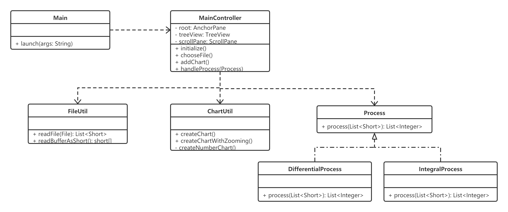
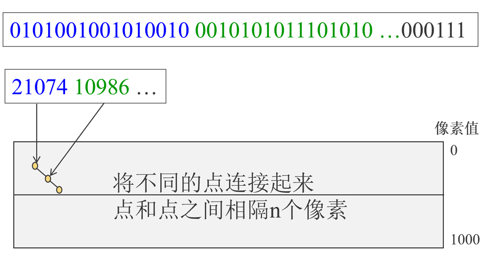

# Chart系统详细设计
## 1. 系统类设计
 
系统的类图如上图所示，该系统的主要类包括Main, MainController, FileUtil, ChartUtil，并定义了Process接口以及它的两个实现：DifferentialProcess和IntegralProcess类。  
这些类的主要作用如下：
+ Main类继承了Application类，并定义了main()方法，用于启动JavaFX应用程序。
+ MainController类负责对主界面上的元素进行控制，并对用户的操作作出响应。同时，需要负责调用系统当中的其他模块，将结果向用户进行展示。
+ FileUtil类负责将用户选择的二进制文件按照字节读入到内存当中，并且将每2个字节（16位）的二进制数转换为16位整型数（short），并读取到列表当中。
+ ChartUtil类负责将数据转换转换为图表，并实现对图表的拖动以及缩放功能。
+ Process接口负责进行数据的处理，主要是将从文件中读取出的16位整型数输入到该模块，由其进行数据处理之后，再返回数据处理的结果。DifferentialProcess和IntegralProcess分别在该接口的基础上实现了微分处理和积分处理。
## 2. 数据介绍
Chart系统的数据源是任意一个二进制文件，系统会读取文件的二进制数，并将每16位二进制数读成一个short型整数，存储到List当中。在图标当中，这些数据会被映射为纵坐标。大致如下图所示：  
 
之后则可以通过process包下的相应模块对原始数据进行处理，得到处理后的数据。
## 3. 处理算法
### 3.1	文件读取模块
#### 3.1.1	文件读取模块概述
文件读取模块的实现主要集中在FileUtil类当中，主要实现的功能即为将二进制文件当中的数每16位读取到一个short型整数当中，以用于后续的图标生成。  
该模块将文件以二进制字节（byte）的形式读出，之后再将每两个byte封装为一个short数。  
而这里存在一个问题，即生成16位整数时是以大端形式进行读取还是以小端形式进行读取，我们将选择权留给了使用者，使用者可以修改配置文件当中的“chart.endian”配置对读取的标准进行修改。
#### 3.1.2 具体实现函数
FileUtil类中具体实现的方法主要有：readFile()和readBufferAsShort()。 

|||
|-|-
|函数名|readFile()|
|参数|File: 待读取的二进制文件|
|返回值|List\<Short>：将二进制数据转为16位整数的list|
|说明|按照大端或小端的方式，将文件读取为整数列表|
 

|||
|-|-
|函数名|readBufferAsShort()
|参数|byte[]：待转换的byte数组 int: byte数组中存储的有效byte的数量 ByteOrder: 设定以大端或小端的形式读取
|返回值|short[]: 转换为16位整数后得到的数组
|说明|按照大端或小端的方式，将字节数组转换为整数数组
 
### 3.2	图表显示模块
#### 3.2.1	图表显示模块概述
图表显示模块主要负责根据文件读取模块或数据处理模块得到的数据转换为图表，并显示到用户界面上。同时，图表显示模块还应该为用户提供图表拖动和图表缩放的功能，以确保用户可以正常的查看数据点较多的图表。  
对于图表的显示，本系统主要是通过JavaFX提供的Chart类实现的，在新建一个Chart类之后，向其中按序添加数据点。  
而为了正确显示数据点较多的图表，我选择了JavaFX提供的ScrollPane控件作为数据图表的容器，同时根据先前读取的数据点的数量动态定义Chart的长度。通过这种方法，在生成数据图表之后，数据图表就可以正常地显示数据点，而不会因为数据点过于密集导致数据点无法正常查看。对于数据图表超出页面的部分，则可以通过ScrollPane所提供的滚动条进行拖动查看。  
而对于页面的缩放，我是通过调用JFXUtils库中的JFXUtil类，调节图表的范围来实现的。
#### 3.2.2	具体实现函数
图表显示模块的主要实现集中在ChartUtil类当中，其中主要的方法有：createChart()和createChartWithZooming()。  

|||
|-|-
函数名|createChart()
参数|List\<Short>:从文件读取出的16位数字 int: 生成的图表类型
返回值|Chart: 生成的图表
说明|将从文件读取出的16位数字转换为图表
 

|||
|-|-
|函数名|createChartWithZooming()|
|参数|List<Short>:从文件读取出的16位数字 int: 生成的图表类型|
|返回值|Chart: 生成的带缩放功能图表|
|说明|将从文件读取出的16位数字转换为图表，并为其添加缩放功能|
 

### 3.3 数据处理模块
#### 3.3.1	数据处理模块概述
数据处理模块主要负责将文件读取模块读取得到的数据进行一些简单的处理，以生成新的数据，并可用于生成另外一张图表。本项目中简单实现了微分和积分处理，由于生成的图表本身为折线图，这里我们的微分和积分计算是通过差分和求和来简化完成的。也就是说，DifferentialProcess类生成的是将数据源列表中的后一项减去前一项所得到的差分结果，而IntegralProcess类生成的则是将数据源列表中的点与其前99项求和所得到的结果。
#### 3.3.2	具体实现函数
数据处理模块的主要实现在process包下的DifferentialProcess类和IntegralProcess类当中，这两个类各自实现了Process接口的process()方法。 
**DifferentialProcess类**： 

|||
|-|-
|函数名|process()
|参数|List\<Short>:从文件读取出的16位数字 
|返回值|List\<Integer>:处理后得到的数据
|说明|将数据进行微分（差分）处理
 

**IntegralProcess类**: 
|||
|-|-
|函数名|process()
|参数|List\<Short>:从文件读取出的16位数字 
|返回值|List\<Integer>:处理后得到的数据
|说明|将数据进行积分（求和）处理