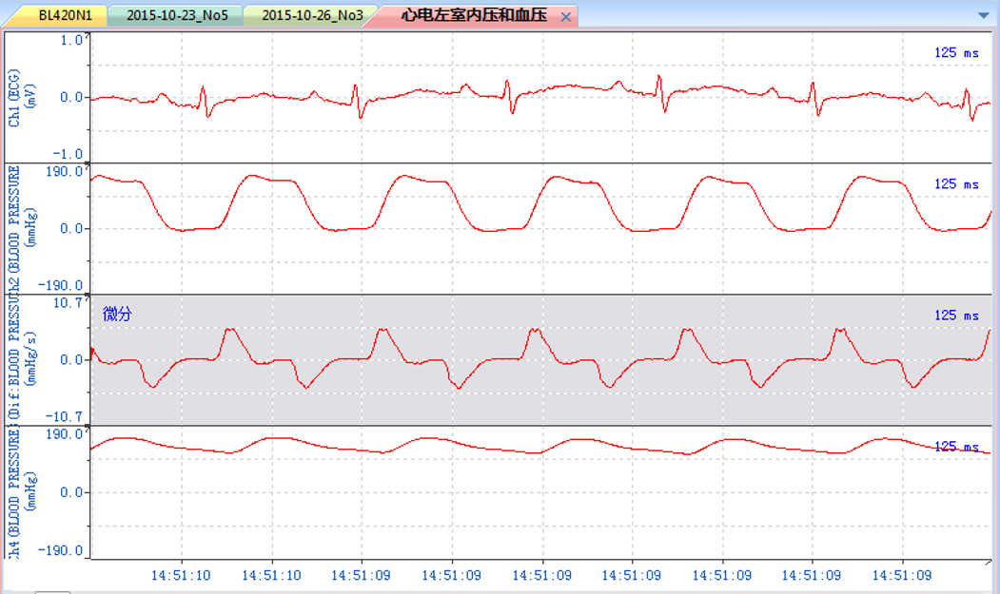

# Chart系统项目需求说明
## 一、功能需求概述
Chart系统需要实现一个简易的图形用户界面，并且可以同时显示多个图表。用户在通过Chart系统打开文件之后，Chart系统根据文件的二进制字节码，将每16位读作一个数字，并且映射到图表当中作为点，并根据这些数据点生成数据图表。  
由于文件的大小可能不同，在打开大文件时，一个窗口可能无法显示所有的点，如果强行显示所有的点会导致数据点过于密集，从而无法看清数据的详情。因此，Chart系统需要支持对图表的缩放以及拖动，使用户可以看清图像的数据点。  
此外，由于图表经常需要进行一定的数据处理，因此，Chart系统需要实现对图表进行微分、积分等数据处理，并将处理后的结果和处理前的原始数据一起显示在界面上。  
大致效果如下图所示：

## 二、项目的功能点
1. 可以读取任意的二进制文件，并根据二进制文件当中的数据生成图表。
2. 可以对图表进行拖动和缩放。
3. 可以显示多个通道，并对原始数据进行数据处理。
## 三、非功能需求
1. 在文件大小正常时，所有操作应该在1s内完成响应。
2. 系统在开发过程中应注重代码布局和代码设计，保证代码的可维护性。
3. 软件在运行发生异常时应该将错误信息记录在日志当中，以便于对潜在的问题进行修复，并且使得用户了解发生了什么错误。
4. 该软件使用的数据应该从本地文件打开，并且应用程序本身不应连接网络，以防止出现数据泄露的情况。
## 四、质量属性需求
对于Chart系统，主要需要考虑的质量属性主要包括可用性、性能、易用性以及可修改性。  
其中，可用性是指在特定时间内系统能够正常运行的概率或时间占有率期望值。如果Chart系统不具有足够的可用性，那么在较长的一段时间内系统处于不可用的状态，用户连正常使用系统都不能做到，用户体验也就无从谈起了。  
性能也是我们需要考虑的质量属性之一。性能取决于时间和软件系统满足时序要求的能力，它与事件的到达和事件的响应有关。如果Chart系统的性能低下，那么当用户进行操作时时，得到反馈的时间就会较长，导致用户体验较差。  
易用性也是维护用户体验的一项很关键的质量属性，如果系统的操作非常复杂，用户上手使用就会比较困难，这会加大用户的学习成本，同时也会降低用户的用户体验。  
可修改性是关于变更的质量属性，它以变更的成本和风险为中心。具有高可修改性可以使得在后续迭代开发过程中开发成本较低，且可以具有较高的迭代开发效率。
