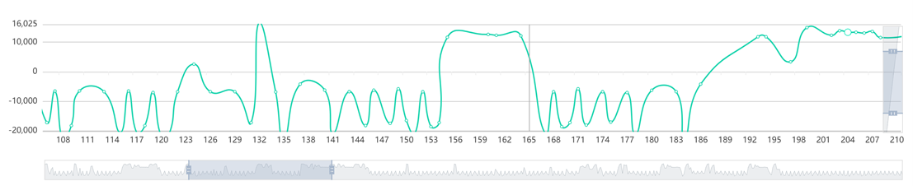

# Chart系统项目报告
## 1. 需求说明
Chart系统是一个简易的图表显示系统，它支持读取任意二进制文件，并将二进制文件的数据的每16位（即2个字节）读取为一个16位整型数，作为图表的数据源。从文件读取的整数应映射为文件的纵坐标，而数据的横坐标则以读取顺序为准。  
由于不同的文件大小差异巨大，部分较大的文件会对应相对较多的数据点，这些数据点可能无法一次性全部显示在一个屏幕上的一张图表当中。因此我们的系统需要支持对图表进行缩放和拖动，使得数据点不会过于密集地分布于同一片区域当中，导致无法正确地看清数据点。  
此外，由于图表经常需要进行一定的数据处理，因此，Chart系统需要实现对图表进行微分、积分等数据处理。  
而在观察图表的过程当中，也常常需要对数据进行对比，因此，Chart系统需要支持在一个应用程序当中同时显示多个通道，并可以将原始数据以及各种经过处理后得到的数据放在这些通道当中，便于用户进行对比查看。  
在开发Chart系统的过程中，应该保证应用程序有较强的易用性，确保用户上手使用相对简单，降低用户对该系统的学习成本，尽可能通过简便的操作提高用户体验。此外，程序的可修改性和可维护性也是相当重要的，这关系到系统在后续能否得到高效的维护和迭代开发，对于系统的长期稳定运行和发展有很重要的意义。
## 2. 概要设计
### 2.1	设计概述
Chart系统由JavaScript进行开发，以Vue作为页面框架。即主要页面通过Vue来实现，而底层的逻辑运算则通过JavaScript进行。  
Chart系统主要需要实现的功能是从任意二进制文件当中读取出二进制数据流，之后将其中的每16位（2 bytes）读取为一个16位整型数，并将读取的结果映射为图表的纵坐标。而为了便于查看数据和对数据进行分析，还需要实现对图表的缩放和拖动，以及对数据进行一些简单的处理。
### 2.2 模块设计
该系统主要分为文件模块、图标模块和处理模块，大致的系统结构如下图所示： 

各模块具体功能为：
+ 文件模块：负责文件的读取，将二进制文件读取为16位整数作为数据源。
+ 图表模块：负责将数据映射到图表上，并将图表显示到用户界面当中。
+ 处理模块：负责对数据进行简单处理。

### 2.3	用户界面设计

界面设计如上图所示，界面的上方为操作栏，可以进行文件的打开以及对数据的简单处理。  
界面下方为图表区域，可以支持同时显示多个图表，便于用户将经过数据处理后的数据与原始数据进行对比。每个图表的x轴和y轴各有一个拖动条，分别负责对x轴和y轴进行缩放。

## 3. 详细设计
### 3.1	数据介绍
Chart系统的数据来自任意一个二进制文件，系统会读取文件的二进制数，并将每16位二进制数读成一个short型整数，将这些整数映射为图表当中的纵坐标。图表中数据点的横坐标则由读入顺序决定。  
生成数据点之后，将相邻的数据点连接起来，就形成了整体的数据图表。

### 3.2	处理算法介绍
#### 3.2.1	文件读取算法
##### 3.2.1.1	算法概述
文件读取算法主要将文件以二进制字节（byte）的形式读出，之后再将每两个byte封装为一个16位int数（int16）。大致的转换方式是将文件读取到ArrayBuffer当中，再根据ArrayBuffer当中的字节生成int16数组。

##### 3.2.1.2	具体实现函数
|||
|-|-
函数名|readFile()
参数|File：需要读取的文件
返回值|无返回值，通过回调函数将数据直接填入图表
说明|将文件中的字节以16位整型数组的形式读入

#### 3.2.2	图表显示算法
图表显示算法主要将数据转换为图表，并显示到用户界面上。同时还应该为用户提供图表拖动和图表缩放的功能，以确保用户可以正常的查看数据点较多的图表。  
这里主要是通过ECharts组件的缩放功能实现的。
#### 3.2.3	数据处理算法
数据处理算法主要负责将从文件中读取出的原始数据进行微分、积分等简单处理之后返回。由于从文件生成的图表是折线图，这里我们的微分和积分计算是通过差分和求和来简化完成的。主要的功能由differential()函数和integral()函数实现。 

|||
|-|-
函数名|differential()
参数|rows: 处理前的json数组，包括数据点的横纵坐标
返回值|处理后的json数组
说明|将数据进行微分（实际上是差分）处理

|||
|-|-
函数名|differential()
参数|rows: 处理前的json数组，包括数据点的横纵坐标
返回值|处理后的json数组
说明|将数据进行积分（实际上是求和）处理

## 4.	测试结果
### 4.1	测试概述
对于Chart系统，我主要进行了单元测试和集成测试。在单元测试部分，我主要对系统的文件模块以及处理模块进行了单元测试；而集成测试部分，则是在我初步build系统之后对功能进行了基本的测试。

### 4.2	单元测试
#### 4.2.1	文件模块
测试用例1： 
+ 输入：二进制文件，包含的二进制字节为：0x1E, 0x36, 0x01, 0x06, 0x22, 0xff
+ 期望输出：int16数组，内容为7734, 262, 8959
+ 实际输出：[7734, 262, 8959]

#### 4.2.2	数据处理模块
differential()函数： 
测试用例1：
+ 输入：json数组，包括x和y
[{0, 1}, {1, 2}, {2, 3}, {3, 4}]
+ 期望输出：[{0, 1}, {1, 1}, {2, 1}]
+ 实际输出：[{0, 1}, {1, 1}, {2, 1}]

integral()函数： 
测试用例1：
+ 输入：json数组，包括x和y
+ [{0, 1}, {1, 2}, {2, 3}, {3, 4}]
+ 期望输出：[{0, 1}, {1, 3}, {2, 6}, {3, 10}]
+ 实际输出：[{0, 1}, {1, 3}, {2, 6}, {3, 10}]

### 4.3	集成测试
#### 4.3.1	打开文件功能
+ 前置条件：无
+ 操作步骤：
    1. 点击上方“打开文件”按钮
    2. 在文件选择器中选择文件并打开
+ 预期结果：显示出相应的图表
+ 实际结果：

#### 4.3.2	图表缩放功能
+ 前置条件：文件已经打开，且图表已经正确显示
+ 操作步骤：
    1. 拖动x轴拖动条
    2. 改变y轴拖动条的大小，并滚动鼠标滚轮
+ 预期结果：图表得到正确的拖动和缩放
+ 实际结果：

#### 4.3.3	数据处理功能
+ 前置条件：文件已经打开，且图表已经正确显示
+ 操作步骤：
    1. 点击上方“微分”按钮
+ 期望结果：正确显示微分图像
+ 实际结果：

### 4.4 测试结论
经过一系列单元测试和集成测试，可以确认系统可以正常运行，没有明显缺陷。